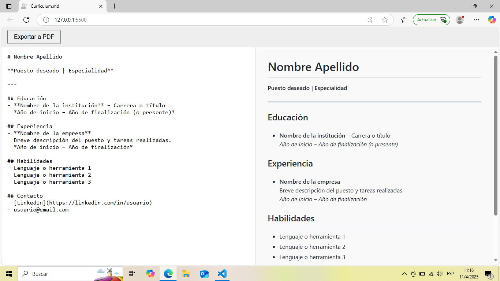

# Curriculum.md

Generador de currículum vitae en línea basado en Markdown.  
Escribí tu CV en formato `.md` en el panel izquierdo y visualizá una vista previa formateada en tiempo real.  
Luego, podés exportarlo como PDF con un solo clic.



---

## 🚀 Características

- Editor de Markdown en vivo.
- Renderizado con estilo tipo GitHub.
- Botón para exportar directamente como PDF.
- Vista previa adaptable para impresión.
- Diseño limpio y responsive.
- Sin backend. 100% web estática.

---

## 🧱 Estructura del proyecto

```
curriculum.md/
├── index.html
├── css/
│   └── style.css
├── js/
│   └── main.js
├── assets/
│   ├── icon.png
│   └── preview.png
├── README.md
├── LICENSE
```

---

## 🖥️ Cómo usar

1. Cloná o descargá el proyecto.
2. Abrí `index.html` en tu navegador.
3. Escribí tu CV en el panel izquierdo.
4. Visualizá el resultado en la derecha.
5. Hacé clic en “Exportar a PDF” para guardar tu CV.

---

## 📄 Licencia

Este proyecto está licenciado bajo los términos de la licencia MIT.  
Consultá el archivo [LICENSE](./LICENSE) para más información.

---


## 🙏 Agradecimientos

Este proyecto fue inspirado y apoyado por herramientas y recursos de código abierto. ¡Gracias a sus creadores por compartir su trabajo!

- 🧠 Interfaz y experiencia inspiradas en [md2pdf](https://md2pdf.netlify.app) – Proyecto de @realdennis
- 📄 Estilo visual de Markdown proporcionado por [github-markdown-css](https://github.com/sindresorhus/github-markdown-css)
- 🎨 Ícono de CV diseñado por [Freepik](https://www.flaticon.com/authors/freepik) en [Flaticon](https://www.flaticon.com/free-icon/cv_3135800)
- 🛠 Renderizado de Markdown gracias a [Marked.js](https://github.com/markedjs/marked)

---


### Hecho con ❤️ por [Lucas Morales](https://github.com/LucasAMoralesRomero)